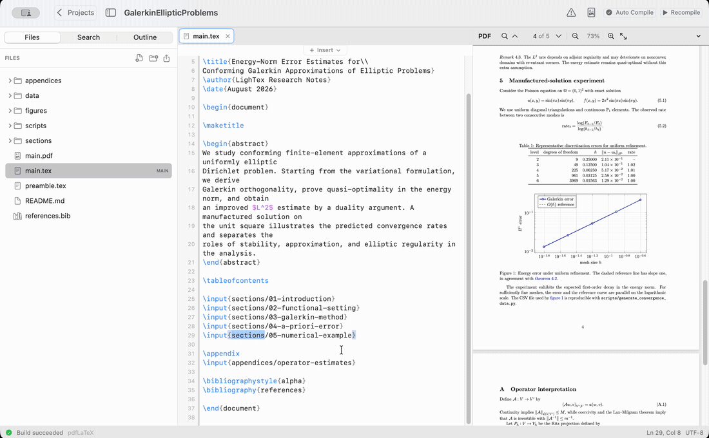

  

<h1 align="center">LighTex 1.1</h1>

  A focused local LaTeX editor for macOS and Linux, with source and PDF side by side.

  
  
  

  Apple Silicon: macOS 11+ · Intel Mac: macOS 10.15+ · Linux: Ubuntu 22.04+ or Debian 12+, x86_64

  

> [!IMPORTANT]
> **macOS may block LighTex on the first launch.**
>
> LighTex is distributed directly through GitHub and is **not notarized by Apple yet**.
> This means macOS Gatekeeper may show a warning even though you intentionally downloaded the app.
>
> To open LighTex:
>
> 1. Move **LighTex** to your **Applications** folder.
> 2. In Finder, Control-click (or right-click) **LighTex**.
> 3. Choose **Open**.
> 4. Click **Open** again in the confirmation dialog.
>
> If macOS still blocks the app, open:
>
> **System Settings → Privacy & Security**
>
> Scroll down to the **Security** section and click **Open Anyway** next to LighTex.
>
> You normally only need to do this once.
>
> **Do not disable Gatekeeper globally.**

## Feedback

Found a bug or have an idea for improving LighTex?  
[Open an issue](https://github.com/Samoilov2004/LighTeX/issues) — suggestions and feedback are welcome.

## Install

### macOS

1. Choose the Apple Silicon or Intel download button above.
2. Open the DMG and drag **LighTex** into **Applications**.
3. Start LighTex and use an existing TeX installation or choose the recommended **Standard** runtime.

### Ubuntu and Debian

1. Download the `.deb` package using the Linux button above.
2. Open it with your system's Software Install application and choose **Install**.
3. Start LighTex from the applications menu and select a TeX provider.

Projects remain ordinary folders on your computer. Removing LighTex never removes your `.tex`, image, bibliography, or PDF files.

## Highlights

- CodeMirror LaTeX editor with multiple tabs, completion, snippets, autosave, and project-wide search.
- Continuous PDF preview with search, zoom, page navigation, and forward/inverse SyncTeX.
- Files, Search, and Outline navigation with safe rename, duplicate, move, upload, and Trash operations.
- Compact Insert Shelf with searchable symbol categories, equations, figures, and selectable table sizes.
- Reusable personal templates plus real first-page previews for bundled templates.
- pdfLaTeX, XeLaTeX, and LuaLaTeX through system TeX or signed managed runtimes.
- Atomic saves, external-file conflict handling, grouped build diagnostics, and missing-package installation.

## Platforms

| Package | Supported systems |
| --- | --- |
| Apple Silicon DMG | macOS 11 Big Sur and newer on M-series Macs |
| Intel DMG | macOS 10.15 Catalina and newer on Intel Macs |
| Linux `.deb` | Ubuntu 22.04+, Ubuntu 24.04+, and Debian 12+ on x86_64 |

Windows, Linux ARM, AppImage, Flatpak, and automatic application updates are not part of version 1.1.

## Development

LighTex 1.1 uses Tauri 2, Rust, React, TypeScript, CodeMirror 6, and PDF.js. Build instructions and release details are documented in [DEVELOPMENT.md](DEVELOPMENT.md), with the internal architecture in [docs/architecture.md](docs/architecture.md).

Licensed under the [MIT License](LICENSE).
