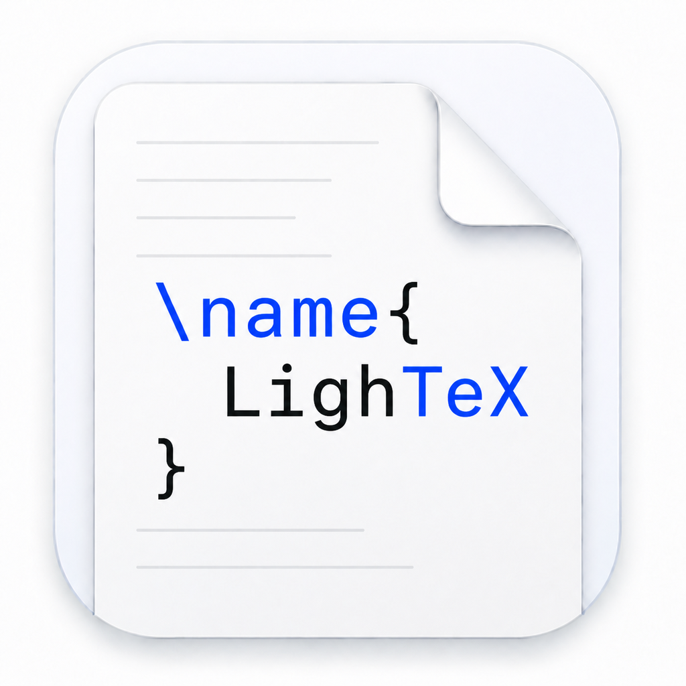

  

<h1 align="center">LighTex</h1>

  A focused native LaTeX editor for macOS with source and PDF side by side.

  
  

  Requires macOS 14 or newer · Not sure which version? Open <strong>Apple menu → About This Mac</strong>.

> [!IMPORTANT]
> **macOS may block LighTex on the first launch.**
>
> LighTex is distributed directly through GitHub and is **not notarized by Apple yet**.
> This means macOS Gatekeeper may show a warning even though you intentionally downloaded the app.
>
> To open LighTex:
>
> 1. Move **LighTex** to your **Applications** folder.
> 2. In Finder, Control-click (or right-click) **LighTex**.
> 3. Choose **Open**.
> 4. Click **Open** again in the confirmation dialog.
>
> If macOS still blocks the app, open:
>
> **System Settings → Privacy & Security**
>
> Scroll down to the **Security** section and click **Open Anyway** next to LighTex.
>
> You normally only need to do this once.
>
> **Do not disable Gatekeeper globally.**

## Install

1. Download the DMG using the button above.
2. Open it and drag **LighTex** into **Applications**.
3. Start LighTex and choose the recommended **Standard** LaTeX runtime.

This release is not notarized by Apple yet. If macOS blocks the first
launch, Control-click **LighTex** in Finder, choose **Open**, then confirm
**Open**. You only need to do this once.

## What you get

- A native macOS source editor and PDF preview in one window.
- Local projects: your `.tex`, images, bibliography, and PDF stay in a normal folder.
- Multiple open files, project navigation, document outline, and SyncTeX jumps.
- Project-wide search and replace, grouped build diagnostics, and PDF search.
- Reusable project templates and a compact shelf for symbols, equations, figures, and tables.
- Protection against unsaved work and files changed by another application.
- Autosave and calm Auto Compile after you stop typing.
- pdfLaTeX, XeLaTeX, and LuaLaTeX through a managed downloadable runtime.
- Signed runtime manifests, SHA-256 verification, and atomic installation.

Requires macOS 14 or newer. Choose the main button for Apple Silicon Macs
(M1, M2, M3, M4, and newer). Use the Intel link only if **About This Mac** says
`Processor` instead of `Chip`.

## For developers

Build instructions, clean-room testing, release architecture, and required
tools are documented in [DEVELOPMENT.md](DEVELOPMENT.md).

LighTex is a light-mode macOS application distributed directly through GitHub.
